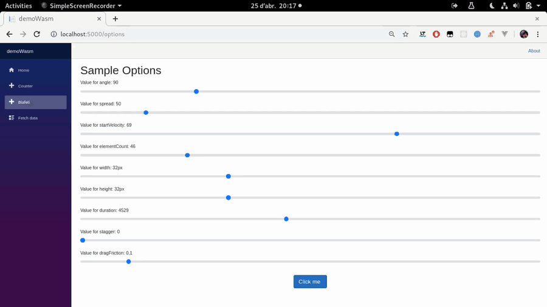

# Blafetti

### Blafetti = Blazor + Confetti

This is tow Blazor component you can use to add confetti to your buttons or elements. 

* `blazor-blazor-confetti`: A 100% JS free native blazor component. This component is a clone of [dom-confetti](https://github.com/daniel-lundin/dom-confetti) but without javascript, just Blazor.
* `blazor-dom-confetti`: A blazor wraper component for [dom-confetti](https://github.com/daniel-lundin/dom-confetti).


### Devs love screenshots



### Show me the code

```razor
@page "/counter"
@using BlafettisLib

<button class="btn btn-primary" @onclick="IncrementCount">
    Click me
    <Blafettis @ref="blafettis" />
</button>

@code {
    private int currentCount = 0;
    protected Blafettis blafettis;

    private void IncrementCount()
    {
        currentCount++;
        blafettis.RaiseConfetti();
    }
}
```

### Contributions

* Be free to PR any feature or bugfix.
* Be free to post any issue.

### ToDo

* `blazor-blazor-confetti`:
  * Add cancelation token to stop confetti async function on dispose.

* `blazor-dom-confetti`:
  * Send options to dom-confetti.

### Know issues

* dom-confetti uses [requestAnimationFrame](https://developer.mozilla.org/es/docs/Web/API/Window/requestAnimationFrame) that is not available on Blazor. The Blazor version just has a main loop using 100% cpu redrawing confettis.

### About

* License MIT, copyright Dani Herrera. Physics of this code is a direct translation of Daniel Lundin's DOM-Confetti code.

